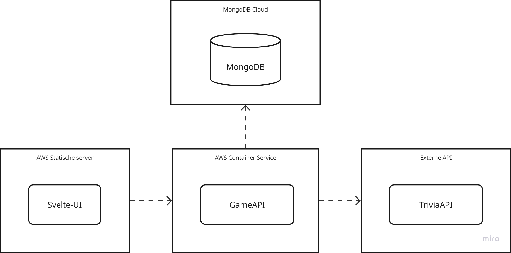
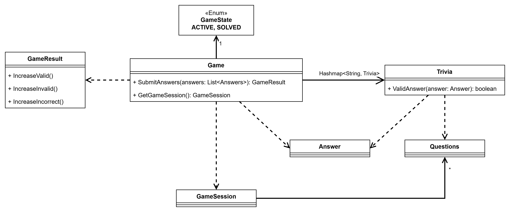
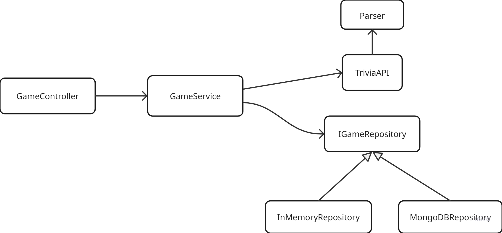

# Little Trivia Game Application

Een eenvoudige trivia-applicatie met een Java Spring Boot backend en een Svelte frontend.

## Projectoverzicht

- Backend: Java 21, Spring Boot 4.1
- Externe vraagbron: Open Trivia Database (`https://opentdb.com/`)
- Opslag: tijdelijk in een in-memory repository
- UI: Svelte (separate client-side project)

## Architectuur

1. De client vraagt het spel aan bij de backend via `/game`.
2. De backend haalt `amount` vragen op bij de Trivia API.
3. Vragen worden geparsed en opgeslagen in een in-memory game repository.
4. De client stuurt antwoorden naar `/game/solve` voor scoreberekening.

### Systeemontwerp

### Domeinmodel

### Service depedencies


## Belangrijke endpoints

- `GET /` - healthcheck, geeft de tekst `Positive`
- `GET /game?amount=5` - start een nieuw spel met standaard 5 vragen
- `PUT /game/solve` - stuur een JSON body met een `gameId` en een lijst `answers`

### Voorbeeld request `GET /game`

- Response: `GameSession` met de vragen en keuzes

### Voorbeeld request `PUT /game/solve`

```json
{
  "gameId": "<uuid>",
  "answers": [
    { "question": "...", "answer": "..." }
  ]
}
```

- Response: `GameResult` met de score en resultaatgegevens

## Code- en dataflow

- `com.trivia2.data.TriviaAPI` haalt vragen op bij de externe API
- `com.trivia2.services.implementation.Parser` zet de API-response om naar het eigen `Trivia` model
- `com.trivia2.services.implementation.GameService` beheert spelcreatie en antwoordverwerking
- `com.trivia2.data.InMemoryGameRepository` houdt lopende spellen bij in een `HashMap`

## Runnen

- Bouw en start de backend met Gradle:
  - `./gradlew bootRun` (Windows: `gradlew.bat bootRun`)
- De backend draait standaard op `http://localhost:8080`

## Toekomstige verbetering

- Vervang de in-memory repository door een echte database (bijvoorbeeld MongoDB)
- Voeg betere foutafhandeling en validatie toe
- Maak de frontend- en backend-integratie robuuster
